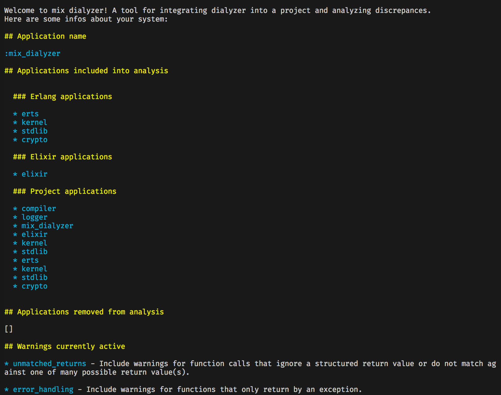
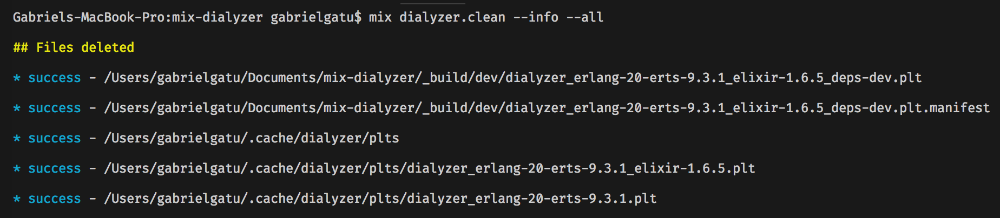

# Project structure

- /lib
    - /command_line: parsing of command line arguments for mix.dialyzer
    - /dialyzer
        - /plt
            - app.ex: get informations about single applications
            - builder.ex: module for building plts
            - command.ex: module for sending commands to :dialyzer
            - manifest.ex: handling manifest file for caching purposes
            - path.ex: utilities for generating plts paths
            - plt.ex: main module for interfacing with the plt folder
            - updater.ex: module for updating plts

        - config.ex: main module for handling *.dialyzer.exs*
        - dialyzer.ex: actual module that runs dialyzer
        - project.ex: utilities for accessing project level informations
    - /mix
        - /tasks: all mix tasks supported, one per file
    application.ex

# Preface

This project born as an imitation of dialyxir. I've started by looking at all the source code, and copying the bits I needed.

After I had a prototype working, I've started by cleaning and splitting functionalities into different modules.

The third step has been building on top of the resulting project I had, by implementing new functionalities.

This is why you can find some of the ideas implemented here also in dialyxir.
So, I would like to thank Jeremy and all the contributors of dialyxir, without you,
this would have been much harder!

# Starting point: **mix dialyzer**

The `mix dialyzer` task doesn't require any argument, and takes care of different
things:
    
- Creating a configuration file in case it doesn't exist (.dialyzer.exs)
- Creating all the necessary plts
- Caching the plts in the proper folders and building a manifest file
- Updating the project plt with the latest changes
- Displaying to the user the result of the analysis

# Configuration file

First of all, when `mix dialyzer` is executed, it searches for a file called
**.dialyzer.exs** inside the project root.

This configuration file is similar in scope to what the *.credo.exs* or the *.formatter.exs* do: it is used to configure the dialyzer application, and allows the user to control the applications analyzed/excluded, the active warnings and external build directories.

In case this file is missing, mix_dialyzer creates a new one, with some default settings:

```elixir
[
  warnings: [:unmatched_returns, :error_handling, :underspecs, :unknown],
  apps: [remove: [], include: []],
  extra_build_dir: []
]
```

Every time the configuration file is updated (for instance, an application is removed from analysis), the next `mix dialyzer` execution will automatically detect the change and update the plts accordingly.

# Plt creation

The plt building is divided into 3 phases:

- All the direct and transitive dependencies of the project are found and analyzed
- It generates a definition of 3 plts to be created: erlang, elixir and project
- It builds each plt by caching common resources and reusing the previous plt

The first point is pretty straightforward, it gets all the dependencies of the project (by handling also umbrella projects) and transitive dependencies (deps of deps), and for each one, it tries to get informations like declared modules, filepaths and version, caching each visited application and reusing them in case of multiple requests.

In the second point, it uses the previous found applications to define 3 plts to be built in order: the erlang, elixir and project level plts.

The erlang and elixir plts contain constant defined applications:

- erlang: `[:erts, :kernel, :stdlib, :crypto]`
- elixir `[:elixir] ++ erlang`

and are going to be located in the home folder of the user, to allow multiple projects to take advantage of them.

The project plt contains all the applications defined by the elixir plt, plus the applications found at runtime with the analysis (1st point), and is going to be located inside the *_build* directory.

In the third point, it builds the plts one by one, starting from the erlang one.
When building a plt that is not the first one, it reuses the previously built plt, by cloning it and removing/adding the applications accordingly.

# Manifest file

After each build/update of the plts, a manifest file is created inside the *_build* directory, living alongside the project level plt.

The manifest file contains a snapshot of the project in that precise moment. When a new **mix dialyzer** invocation happens, the manifest file is the first one checked, by comparing the previously cached snapshot with the current enviroment, and resulting in one of these 3 states:

- `:missing` - plt or manifest file is missing
- `:outdated` - plts and manifest exists, but something is outdated
- `:up_to_date` - everything seems good

When all plts and manifest are present, to check the status of the project, the manifest is performing different checks:
    
- Snapshot applications are the same as current applications
- No applications has been included/removed by the `.dialyzer.exs` config file
- They have the same version

# Plt updating

When the manifest file returns an `:outdated` status, a plt updating occours.
In this case, the manifest file returns a list of all the applications that has been changed, by specifying if they have been removed, added or changed.

The updating process takes these applications, and creates 2 lists of modules:

- 1: Modules to remove
- 2: Modules to add

In the end, it performs the task by removing and then adding the modules to the project level plt. Finally it checks again the plt for consistency.

# Getting project level informations

A new task: `mix dialyzer.info` has been introduced, to get project level informations about the current enviroment setup.

It divides all informations into x main categories:

- **Current application name**

- **Applications included into analysis**: divided into 3 blocks, for erlang, elixir and project

- **Applications removed from analysis**

- **Warnings currently active**: inferred from the `.dialyzer.exs` file, shows also a quick description of the warning

- **Warnings ignored**: a list of all the excluded warnings with a quick description. Handy when the user wants to know all the options available and add them quickly.

- **Build directories**



# Cleaning dialyzer artifacts

Another task, runnable with `mix dialyzer.clean`, is defined.
This allows to clean partially/totally the artifacts generated by the *mix_dialyzer* integration: plt files, manifest file, etc..

There are 2 options available:

- `--info` - used to display success/failure informations as the files are being removed

- `--all` - used to delete also the erlang and elixir plts

By default, when executed, `mix dialyzer.clean` runs without logging anything,
and removes only the project level plt and the manifest file.

